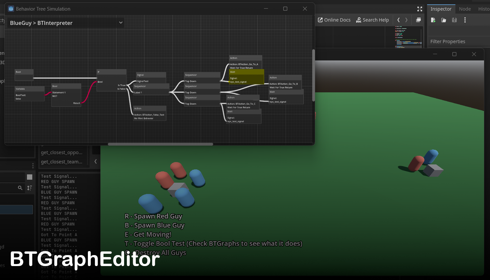

#  BTGraphEditor
An addon for editing, debugging, and running behavior tree graphs. GDExtension binaries for Windows, Linux, and MacOS(Unsigned).

## Features
These are the main features of the addon.
* Edit Behavior Trees using a graph editor. 
* Optional window for debugging BTGraphs in realtime.
* Custom C++ node for speeding up the interpretation of BTGraphs.

## Components
These are the components of the addon.

* **BTInterpreter**: Interprets BTGraphs. 
    * **connect_to_signal(sig_name : String, to_this : Callable)**: Best way to connect an external callable to a signal in the signal Array.
    * **edit_variable(var_name, value)**: Best way to set a variable in the variable Array.
    * **set_random_seed(seed)**: Best way to set the "random_seed" variable.
    * **skip_all_current_nodes()**: Skip all nodes that are waiting.
    * **skip_current_node(which_branch : int)**: Skip the current node on a branch that is waiting.
    * **stop_a_branch(which_branch : int)**: Stop the current branch.
    * **stop_all_branches()**: Stop all branches / reset behavior tree.
* **BTInterpreterCPP**: C++ component for interpreting BTGraphs. Must be a sibling of a **[BTInterpreter]**.
* **BTSimulationGraph**: The window for viewing a simulation of the BTGraph of a **[BTInterpreter]** in runtime. **Display** > **Window** > **Sub windows** > **Embed Sub windows** to show this in a separate window. 
    * **get_all_interpreters(var_name, value)**: Best way to set a variable in the variable Array.
    * **add_one_interpreter(var_name, value)**: Best way to set a variable in the variable Array.

```python
# Example of using some of the functions
func example():
    bt_interpreter = get_node("BTInterpreter")
	(bt_interpreter as BTInterpreter).connect_to_signal("SignalTest", self.callable_test)
    (bt_interpreter as BTInterpreter).edit_variable("BoolTest", true)
	(bt_interpreter as BTInterpreter).set_random_seed((position.x + 1) * (position.y + 1))
```

## Graph Nodes
These are the nodes used in a graph.

* **BoolNode**: Will do an AND, OR, XOR, or NOT operations on inputs.
* **StatementNode**: Will do <, >, or = operations on inputs.
* **VariableNode**: Input variables for the graph. Can be booleans, integers, or floats.
* **IfNode**: Takes a boolean input and outputs based on that value.
* **SequencerNode**: Chooses between multiple outputs based on the type of sequencer: Top-Down, Parallel, Random, and Totally Random.
* **SignalNode**: Emits a signal.
* **ActionNode**: Calls a function as a callable. Can wait on a true return, false return, or nothing.
* **WaitNode**: Waits for an amount time or on a signal to be emitted.
* **CommentNode**: A comment box in a BTGraph. (This Node can be buggy when moved / dragged behind other nodes)

```python
# Example of a function that can be called by an Action Node. Action Node waits for bt_wait[0] to be true.
func BTAction_example (bt_wait : Array):
	if bt_wait:
		if position.distance_to(target.position) < 1:
			velocity = Vector3.ZERO
            print("Got To Target!")
			bt_wait[0] = true
		else:
            print("Going To Target...")
			bt_wait[0] = false
```

## Installation
You can download the whole demo project and open it with Godot or download the "/btgrapheditor" folder from the "/addon" folder and put it in your "/addon" folder in your project. Make sure to enable the addon in your Project Settings.
